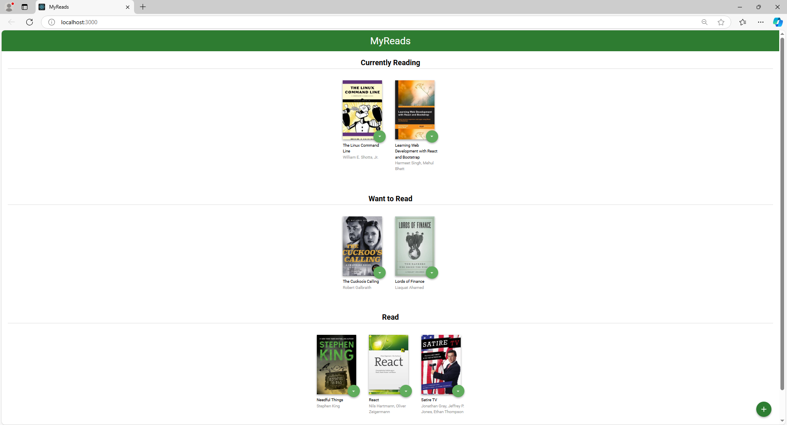

# MyReads App

### Description
A simple app that allows users to organize their books in categories.

**IMPORTANT NOTE:**
Please Turn On THIRD-PARTY Cookies on Google Chrome or keep The tracking preventation At Basic in Microsoft Edge, to compile the App without any ERRORS, also dont forget to clear your Browser History.
Thanks.

### Features
- View books in different shelves based on their reading status (Currently Reading, Want to Read, Read).
- Search for books by title.
- Move books between shelves.
- The application saves your book data, so it persists even after a page refresh.
- Notification has been add to improve the app.

---

## Installation and Setup Instructions

### Prerequisites
To run this project locally, you need to have:
- **Node.js** installed (preferably the latest version).
- **npm** installed.

### Clone the repository:
git clone https://github.com/hazaaAlmarzooqi/MyreadsV4_1_udacity.git

cd MyreadsV4_1_udacity

### Install dependencies:
To install all the required dependencies for the project, use
**npm install**

### Running the Application

To run the development server locally:
**npm start**

Once the development server starts, open your browser and navigate to:
**http://localhost:3000**


## What You're Getting

```bash
├── CONTRIBUTING.md
├── README.md - This file.
├── package.json # npm package manager file. It's unlikely that you'll need to modify this.
├── public
│   ├── favicon.ico # React Icon, You may change if you wish.
│   └── index.html # DO NOT MODIFY
└── src
    ├── App.css # Styles for your app.
    ├── App.js # This is the root of the app.
    ├── BooksAPI.js # A JavaScript API for the provided Udacity backend.
    ├── page # main and search page.
        ├── SearchPage.js # the search page.
        └── Mainpage.js # the Main page.
    ├── components # file that have book.js.
        └── Book.js # books.
    ├── icons # Helpful images for your app. Use at your discretion.
    │   ├── add.svg
    │   ├── arrow-back.svg
    │   └── arrow-drop-down.svg
    ├── index.css # Global styles. You probably won't need to change anything here.
    └── index.js # You should not need to modify this file. It is used for DOM rendering only.
```

### Main Components

- **MainPage**: The homepage where users can view their books categorized into shelves.
- **SearchBooks**: The search page where users can find new books to add to their collection.

---

## Usage

1. **Main Page**: 
   - On the main page, books are categorized into three sections: **Currently Reading**, **Want to Read**, and **Read**.
   - You can move books by selecting the desired shelf from the dropdown menu.

2. **Search Page**: 
   - Navigate to the search page by clicking the "Search Books" button.
   - Use the search bar to look for books by title or author.
   - Add a book.

---

## State Management

The application uses **React's \`useState\` hook** to manage the state of the books. It saves the current book list to the browser's **localStorage**, ensuring that the user's selections persist even after a page refresh.

---

## Technologies Used

- **React.js**: The main library used to build the UI.
- **React Router**: For navigation between different pages (Main Page and Search Page).
- **HTML5/CSS3**: For structure and styling.
- **localStorage**: To persist data between page refreshes.

---

## Screenshots

Here you can add some screenshots of the app for visual reference:

- **Main Page**:
  



- **Search Page**:
  


---

## Contact

If you have any questions or suggestions, feel free to contact me:
- Email: hazza3.ae12@gmail.com
- GitHub: [hazaaAlmarzooqi](https://github.com/hazaaAlmarzooqi)
